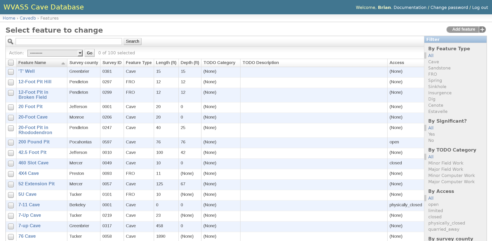

# cavedbmanager

This project was written to simplify the data management for a state
and/or county cave survey. It eliminates the need for the manual duplication
data, which will help to save time and minimize errors. The system will
automatically generate various types of files based on what you upload
to the database: 1) GIS files: SHP, KML, GPX, and PNG (topo maps and
aerial imagery), 2) a PDF that is suitable for publication, and 3) a 
CD/DVD image that can be included with the book that includes select
entrance photos, maps, and references. It eliminates the hassle of
formatting the book and allows the user to concentrate on the collection
of data. This system was used to publish the book _WVASS Bulletin #18:
The Caves and Karst of Tucker County, WV_.

This project is currently used by the West Virginia Speleological Survey
to manage the list of caves within the state. The web interface is only
available to its members.

## Dependencies

* Python
* Python Imaging Library (python-imaging Debian package)
* Python GDAL Library (python-gdal Debian package)
* Django web framework >= 1.0 (http://www.djangoproject.com/)
* A database such as MySQL (mysql-server-5.0 and mysql-client-5.0 Debian packages)
* Mapserver >= 4.10 (mapserver-bin Debian package)
* LaTeX (texlive Debian package)
* zip Debian package
* xsltproc and libxml2-utils Debian packages
* A webserver such as Apache to serve the content (apache2 Debian package)

By default, install the application in /usr/local/cavedbmanager and the
application data in /usr/local/cavedbmanager-data. If you install them in
different locations, then be sure to edit the main settings.py file with that 
information.

You will also need to setup your GIS maps. Put your GIS layers in 
/usr/local/cavedbmanager-data/gis_maps/layers and edit
/usr/local/cavedbmanager-data/gis_maps/cave.map to customize how those
layers will look on the map. See the Mapserver documentation for more 
information about how to customize it.

## Authors

* Brian Masney - [masneyb](https://github.com/masneyb)
* David A. Riggs - [riggsd](https://github.com/riggsd)

Note: This interface stopped being actively developed around 2011. It needs
to be upgraded to a newer version of Python and Django.

## Screenshot

